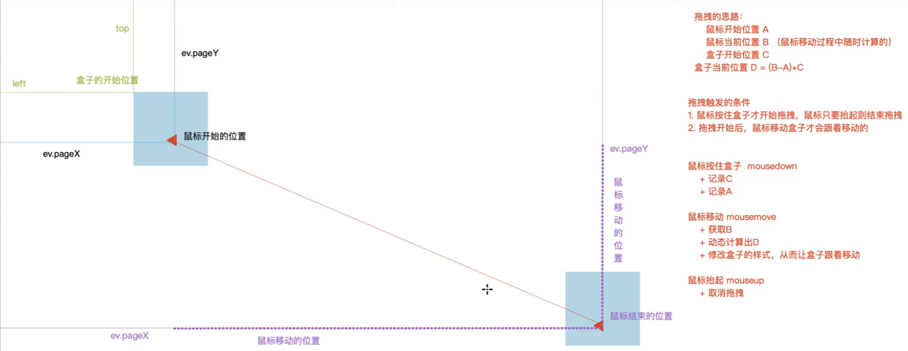
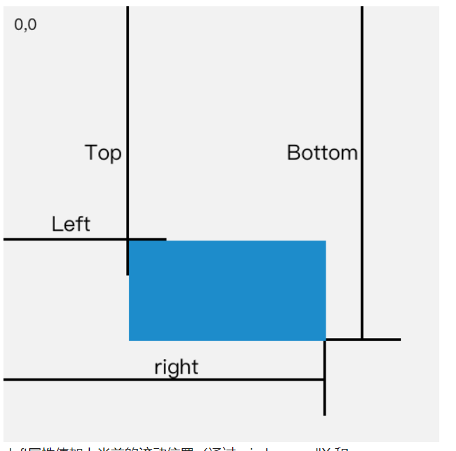

# JS拖拽效果demo

思路

`Element.getBoundingClientRect()`:

> 返回值是一个 `DOMRect` 对象，这个对象是由该元素的 getClientRects() 方法返回的一组矩形的集合，就是该元素的 CSS 边框大小。返回的结果是包含完整元素的最小矩形，并且拥有left, top, right, bottom, x, y, width, 和 height这几个以像素为单位的只读属性用于描述整个边框。除了width 和 height 以外的属性是相对于**视图窗口**的左上角来计算的。
